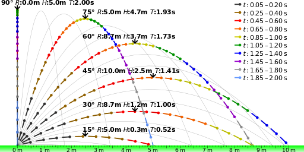
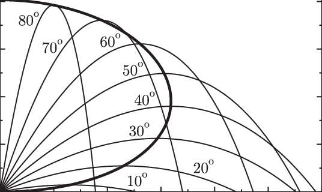

# Problem 1

<h1>Projectile Motion Simulator</h1>

Projectile motion is a fundamental concept in physics that describes the motion of an object launched into the air, subject only to the force of gravity. From a kicked soccer ball to a launched rocket, this type of motion follows a parabolic trajectory, governed by simple yet elegant equations. Understanding how initial velocity and launch angle affect the range, height, and flight time of a projectile provides valuable insights into real-world phenomena.

[simulation](simulation_projecttile.html)

[example vıdeo](projectile_with_embedded_video.html)

# Investigating the Impact of Launch Angle on the Range

## Motivation
While projectile motion may seem simple at first glance, it provides a rich framework for exploring fundamental physics principles. The task is straightforward: analyze how the range of a projectile is affected by its launch angle. However, beneath this simplicity lies a complex system governed by both linear and quadratic relationships, making it both accessible and deeply insightful.

What makes this topic especially compelling is the array of free parameters involved in these equations, such as initial velocity, gravitational acceleration, and launch height. These parameters give rise to a wide range of solutions that can describe everything from the flight of a soccer ball to the trajectory of a rocket.

## Task

### 1. Theoretical Foundation

Start by deriving the governing equations of motion from basic principles. This involves solving a fundamental differential equation to establish the general form of the motion.  
Highlight how changes in initial conditions give rise to a family of solutions.

#### Derivation of Governing Equations

Projectile motion can be broken down into horizontal and vertical components, described by the following kinematic equations:

- Horizontal motion: 
  $$
  x(t) = v_0 \cos(\theta) t
  $$
- Vertical motion: 
  $$
  y(t) = v_0 \sin(\theta) t - \frac{1}{2} g t^2
  $$

Where:
- \( v_0 \) is the initial velocity.
- \( \theta \) is the launch angle.
- \( g \) is the acceleration due to gravity.
- \( t \) is the time of flight.

#### Initial Conditions and General Solution

The initial conditions for projectile motion are:
- \( x(0) = 0 \) (starting from the origin in the horizontal direction),
- \( y(0) = 0 \) (starting from the origin in the vertical direction).

The time \( t \) when the projectile hits the ground (i.e., when \( y(t) = 0 \)) is the key to finding the range \( R \).

From the vertical motion equation:
$$
y(t) = v_0 \sin(\theta) t - \frac{1}{2} g t^2
$$

Setting \( y(t) = 0 \) (when the projectile lands), we get:
$$
v_0 \sin(\theta) t - \frac{1}{2} g t^2 = 0
$$

This simplifies to:
$$
t(v_0 \sin(\theta) - \frac{1}{2} g t) = 0
$$

Solving for \( t \), we discard \( t = 0 \) (the initial time) and solve for the time of flight \( t_f \):
$$
t_f = \frac{2 v_0 \sin(\theta)}{g}
$$

This is the time it takes for the projectile to reach the ground. Now, we can use this to find the horizontal range.

#### Horizontal Range

The horizontal range \( R \) is the distance the projectile travels horizontally before hitting the ground. Since there is no horizontal acceleration (constant horizontal velocity), the range is given by:
$$
