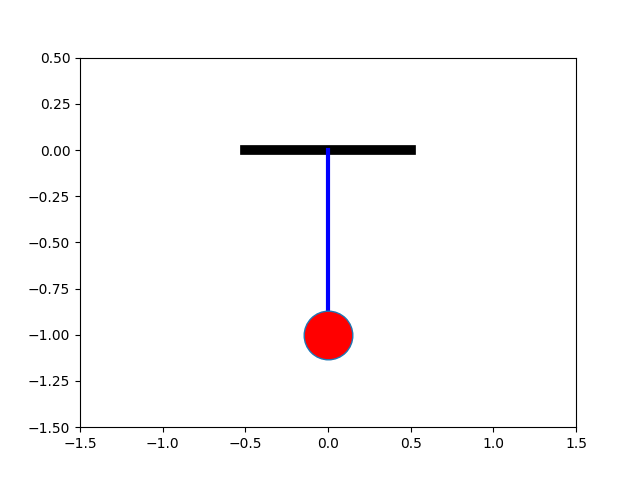
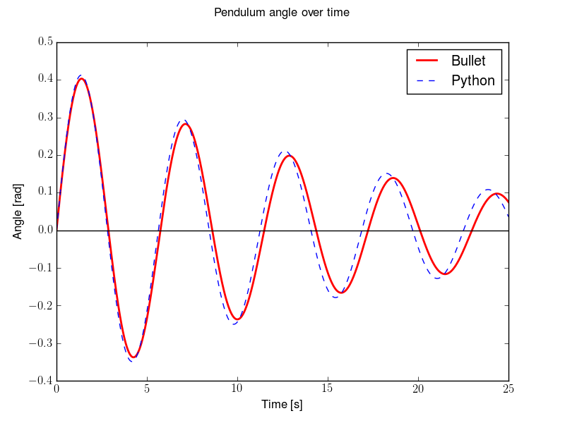

# Problem 2

# Investigating the Dynamics of a Forced Damped Pendulum 

## Introduction
 

The forced damped pendulum is a remarkable system that bridges the gap between predictable periodic motion and the seemingly erratic world of chaos. Despite its simple structure a pendulum experiencing damping and an external driving force its behavior can become astonishingly complex. This system serves as a key model in nonlinear dynamics, shedding light on concepts like resonance, bifurcations, and chaotic motion, which appear in physics, engineering, and even biological systems.

                                                           

[simulation](pendulum_projectile.html)
## Mathematical Framework
The motion of a forced damped pendulum is described by the nonlinear second-order differential equation:

$\frac{d^2\theta}{dt^2} + \gamma \frac{d\theta}{dt} + \omega_0^2 \sin(\theta) = F \cos(\omega t)$

where:
- $\theta $ is the angular displacement of the pendulum,
- $\gamma $ represents the damping coefficient, controlling energy dissipation,
- $\omega_0 $ is the natural frequency of the undriven pendulum,
- $F $ is the amplitude of the external periodic force,
- $\omega $ is the driving frequency.

This equation encapsulates a rich interplay between energy loss, nonlinear restoring forces, and external periodic excitation, leading to an array of fascinating behaviors.

## Methods of Analysis
Given the inherent nonlinearity of the system, direct analytical solutions are often impractical. Instead, various computational and graphical techniques are employed:

- **Numerical Integration**: 

Solving the equation using methods like the Runge-Kutta algorithm to track the evolution of $\theta(t) $.
- **Phase Space Analysis**:

 Examining plots of (\theta, \dot{\theta})  to distinguish between periodic, quasi-periodic, and chaotic motion.
- **Poincaré Sections**:

 Recording the system’s state at discrete time intervals to reveal underlying patterns and transitions to chaos.
- **Lyapunov Exponents**:

 Measuring sensitivity to initial condition a key indicator of chaotic dynamics.

## Emergence of Chaos
One of the most striking aspects of the forced damped pendulum is its ability to exhibit chaos under certain parameter settings. Hallmarks of chaotic motion include:

- **Exponential Sensitivity to Initial Conditions**:

 Small differences in starting conditions lead to vastly different trajectories over time.
- **Aperiodic Behavior**:

 Unlike regular oscillations, chaotic motion lacks strict repetition.
- **Strange Attractors**:

 Instead of settling into a simple fixed point or limit cycle, the system follows a complex but bounded trajectory in phase space.
- **Period-Doubling Route to Chaos**:

 Successive bifurcations in periodicity that eventually give rise to chaotic motion.

These features have profound implications, extending beyond mechanics to climate science, electrical circuits, and even neuroscience.

## Conclusion

The forced damped pendulum is more than just an abstract mathematical construct it is a gateway to understanding the unpredictability inherent in many real-world systems. By tweaking parameters such as damping strength and driving frequency, researchers can explore the delicate balance between order and chaos, revealing the intricate nature of nonlinear dynamics.