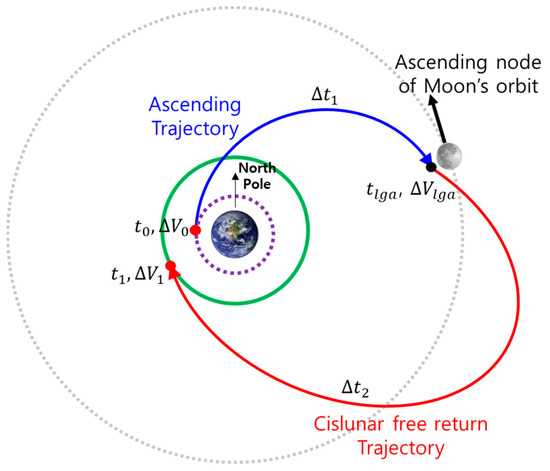

---

# **Problem 3: Trajectories of a Freely Released Payload Near Earth**

## **Motivation**

The trajectory of a payload released from a spacecraft orbiting Earth can vary dramatically depending on its initial velocity and direction. This situation is a real-world application of orbital mechanics and Newtonian gravity.

In space missions, understanding these trajectories is essential for deploying satellites, safely returning payloads to Earth, and planning interplanetary missions. Analyzing the motion of a freely moving object under gravity gives us crucial insights into orbital behavior.


---

## **1. Theoretical Background: Possible Trajectory Types**

The trajectory of an object released into space is determined by its **total mechanical energy**:

### **1.1 Trajectory Types Based on Energy**

| Energy Condition | Trajectory Type       | Description                                 |
| ---------------- | --------------------- | ------------------------------------------- |
| $E < 0$          | Elliptical Orbit      | Bound to the planet; object returns         |
| $E = 0$          | Parabolic Trajectory  | Escape threshold; marginal case             |
| $E > 0$          | Hyperbolic Trajectory | Object escapes planet’s gravity permanently |

### **1.2 Key Physical Equations**

* **Newton’s Law of Gravitation**:

  $$
  F = G \frac{Mm}{r^2}
  $$

* **Acceleration due to gravity**:

  $$
  a = \frac{F}{m} = -\frac{GM}{r^2}
  $$

* **Total Mechanical Energy**:

  $$
  E = \frac{1}{2}mv^2 - \frac{GMm}{r}
  $$

### **1.3 Typical Values (for Earth)**

| Quantity                   | Value                                              |
| -------------------------- | -------------------------------------------------- |
| Gravitational Constant $G$ | $6.674 \times 10^{-11} \, \text{Nm}^2/\text{kg}^2$ |
| Earth’s Mass $M$           | $5.972 \times 10^{24} \, \text{kg}$                |
| Earth’s Radius $R$         | $6.371 \times 10^6 \, \text{m}$                    |

---

## **2. Numerical Simulation**

To simulate motion under gravity, we can use simple numerical methods like **Euler’s Method** or more accurate ones like **Velocity-Verlet**. These methods calculate an object’s trajectory step by step based on Newton’s laws.

---

## **3. Python Simulation**

### Required Libraries

```python
import numpy as np
import matplotlib.pyplot as plt
```

### Constants and Earth Parameters

```python
G = 6.67430e-11  # Universal gravitational constant
M_earth = 5.972e24  # Mass of Earth (kg)
R_earth = 6.371e6   # Radius of Earth (m)
```

### Simulation Function

```python
def simulate_trajectory(r0, v0, dt=1, steps=20000):
    r = np.array(r0, dtype='float64')
    v = np.array(v0, dtype='float64')

    traj = [r.copy()]
    for _ in range(steps):
        r_mag = np.linalg.norm(r)
        if r_mag < R_earth:
            break  # Collided with Earth
        a = -G * M_earth * r / r_mag**3
        v += a * dt
        r += v * dt
        traj.append(r.copy())
    return np.array(traj)
```

---

## **4. Sample Scenarios**

### **Scenario A – Low-Speed Release (Return to Earth)**

```python
traj1 = simulate_trajectory(
    r0=[R_earth + 100e3, 0],  # Released from 100 km altitude
    v0=[0, 500]               # 500 m/s velocity
)
```

 **Explanation**: This velocity is insufficient for orbit. The payload quickly falls back to Earth.

---

### **Scenario B – Orbital Velocity**

```python
v_orbit = np.sqrt(G * M_earth / (R_earth + 300e3))  # Orbital speed at 300 km altitude
traj2 = simulate_trajectory(
    r0=[R_earth + 300e3, 0],
    v0=[0, v_orbit]
)
```

📍 **Numerical Result**:

$$
v_{\text{orbit}} \approx 7.73 \, \text{km/s}
$$

🔻 **Explanation**: The payload enters a stable circular orbit.

---

### **Scenario C – Escape Velocity**

```python
v_escape = np.sqrt(2 * G * M_earth / (R_earth + 300e3))
traj3 = simulate_trajectory(
    r0=[R_earth + 300e3, 0],
    v0=[0, v_escape]
)
```

 **Numerical Result**:

$$
v_{\text{escape}} \approx 10.93 \, \text{km/s}
$$
 **Explanation**: The object exceeds escape speed and leaves Earth’s gravitational field.

---

## **5. Visualization**

```python
def plot_trajectory(trajs, labels):
    plt.figure(figsize=(8,8))
    theta = np.linspace(0, 2*np.pi, 100)
    plt.plot(R_earth*np.cos(theta), R_earth*np.sin(theta), 'k', label="Earth")

    for traj, label in zip(trajs, labels):
        plt.plot(traj[:,0], traj[:,1], label=label)

    plt.xlabel("x (m)")
    plt.ylabel("y (m)")
    plt.legend()
    plt.axis('equal')
    plt.title("Payload Trajectories Near Earth")
    plt.grid(True)
    plt.show()

plot_trajectory(
    [traj1, traj2, traj3],
    ["Return to Earth", "Stable Orbit", "Escape"]
)
```

---

## **6. Discussion and Applications**

* If the object is released at **low velocity** (e.g., 0.5 km/s), it will re-enter Earth and crash. This is applicable to reentry capsules.
* At **orbital velocity**, it can remain in stable orbit — this is the principle behind satellites like the ISS.
* At **escape velocity**, the payload can exit Earth's gravity. This is used for lunar and interplanetary missions like Voyager 1.

These simulations help engineers understand how small velocity changes drastically alter the mission outcome — a critical consideration in spacecraft design and mission planning.

---

## **7. Conclusion**

This simulation shows that gravity is the dominant force in determining an object’s path in space and that the object’s initial velocity and direction are crucial. Numerical tools like Python provide powerful insight into predicting and planning space missions.

---

