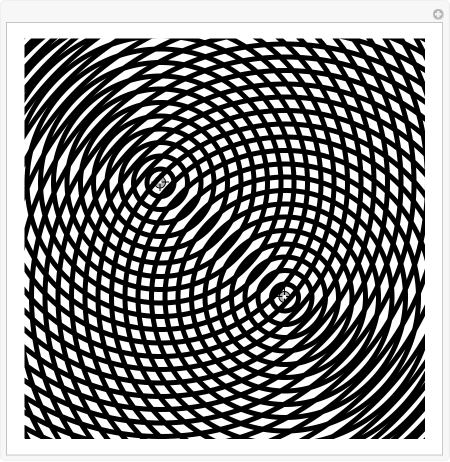

---

#  Interference Patterns on a Water Surface

##  Motivation

Interference patterns occur when waves from different sources overlap, forming regions of constructive and destructive interference. Observing how these ripples interact on a water surface is a powerful way to explore wave behavior and superposition. In this task, we simulate such a pattern using wave sources placed at the vertices of a regular polygon.

---

---

##  Chosen Polygon

We select a **square** as our regular polygon for simplicity and clarity. The wave sources will be placed at its vertices.

---

##  Wave Model

Each point source emits a wave described by:

$u_i(x, y, t) = A \cdot \cos(k r_i - \omega t + \phi)$

Where:
- $u_i$: displacement due to source *i*.
- $A$: amplitude.
- $k=\frac{2\pi}{\lambda}$ : wave number.
- $\omega = 2\pi f$: angular frequency.
- $r_i$: distance from source *i* to point $(x, y)$.
- $\phi$: initial phase (assumed 0 here).
- $t$: time.

The total displacement at any point is:

$$
u(x, y, t) = \sum_{i=1}^{N} u_i(x, y, t)
$$

---

---

##  Results & Analysis

- **Constructive Interference**: Bright/red regions where wave crests from multiple sources align.
- **Destructive Interference**: Dark/blue regions where crests and troughs cancel each other.
- **Pattern Symmetry**: Due to the square configuration, the resulting interference pattern exhibits fourfold symmetry.
- **Fringes and Nodes**: Alternating bands/rings indicating changing interference conditions across the plane.

---

##  Extension Ideas

- Test other polygons: triangle, pentagon, hexagon.
- Animate the simulation over time.
- Explore phase differences between sources.

---

##  Conclusion

This simulation demonstrates how multiple wave sources interact to form complex interference patterns. The symmetry and distribution of nodes/antinodes depend on the geometric arrangement of the sources, providing a beautiful and intuitive insight into wave superposition.

[Wave Interference on the Water Surface simulation](docs.waves.html)